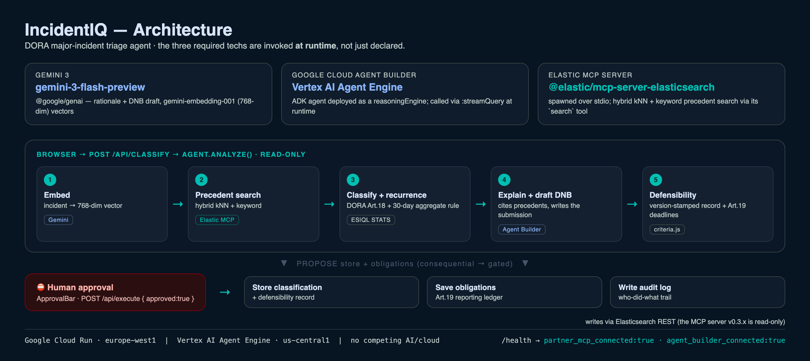

# IncidentIQ — Architecture

DORA major-incident triage agent. It reasons, plans, and acts: search precedents → classify
against DORA Art.18 → draft the regulator submission → **wait for human approval** → write the
record + audit trail. The three required technologies are invoked **at runtime**, not just declared.



## 1. The required trio (all invoked at runtime)

| Tech | Where | How it's invoked | Proof |
|---|---|---|---|
| **Gemini 3** | [`src/agent.js`](src/agent.js), [`src/agent-engine.js`](src/agent-engine.js) | `@google/genai` — `embedContent` (gemini-embedding-001, 768-dim) + `generateContent` (gemini-3-flash-preview); the deployed agent runs `gemini-2.5-flash` on Vertex | `/health → model` |
| **Google Cloud Agent Builder** | [`agent-builder/incidentiq_agent/`](agent-builder/incidentiq_agent/) → Vertex AI Agent Engine | ADK `LlmAgent` deployed to a `reasoningEngine`; the app calls `:streamQuery` for the explain + DNB-draft step | `/health → agent_builder_connected` · `POST /api/agent` |
| **Elastic MCP server** | [`src/elastic-mcp.js`](src/elastic-mcp.js) | spawns `@elastic/mcp-server-elasticsearch` over stdio; precedent search runs through its `search` tool (hybrid kNN + keyword) | `/health → partner_mcp_connected` |

## 2. Request flow

```
Browser (public/index.html)
   │  POST /api/classify            ── read-only, steps 1–5
   ▼
agent.js · analyze()
   1. embed incident                → Gemini  gemini-embedding-001 (768-dim)
   2. precedent search              → Elastic MCP server `search` tool (kNN + keyword)   [partner MCP]
                                       └ REST fallback if the MCP child can't start
   3. classify + recurrence         → criteria.js  (DORA Art.18 thresholds + 30-day aggregate rule)
                                       └ recurrenceCount via ES|QL STATS
   4. explain + draft DNB           → Agent Builder (Vertex AI Agent Engine)             [Gemini + Agent Builder]
                                       └ falls back to direct Gemini, then deterministic
   5. defensibility + deadlines     → version-stamped record, DORA Art.19 timeline
   ─────────────────────────────────────────────────────────────────────
   PROPOSE store + obligations      → returned to UI as a GATED action
   ▼
ApprovalBar (a human clicks Approve)
   │  POST /api/execute  { approved:true }   ── consequential, steps 6
   ▼
elastic.js  (writes via Elasticsearch REST — the MCP server v0.3.x is read-only)
   • store classification + defensibility   • save reporting obligations   • write audit log
```

## 3. Components

- **`src/server.js`** — Express app. Routes, `/health` (truthful wiring report), SPA fallback.
- **`src/agent.js`** — the agent loop: `analyze()` (read-only) and `executeProposed()` (gated writes). Multi-step plan with a per-step trace.
- **`src/elastic-mcp.js`** — MCP client. Lazily spawns the Elastic MCP server, lists tools, runs `search`. Hardened: `transport.onerror`/`onclose`, connect timeout, and `OTEL_SDK_DISABLED` so the server's EDOT banner can't corrupt the stdio JSON-RPC channel.
- **`src/elastic.js`** — Elasticsearch access. Precedent search prefers MCP, REST fallback; ES|QL aggregation (open incidents, recurrence STATS) and the human-approved index writes go via REST.
- **`src/agent-engine.js`** — Vertex AI Agent Engine client. ADC bearer token (`google-auth-library`), `:query` (create session) + `:streamQuery?alt=sse` (parses NDJSON/SSE/array events).
- **`src/criteria.js`** — pure DORA logic: Art.18 thresholds, the recurring-incident aggregation rule, Art.19 reporting deadlines, obligation rows.
- **`agent-builder/incidentiq_agent/agent.py`** — the ADK agent (Gemini + optional Elastic MCP toolset) deployed to Agent Engine.
- **`public/index.html`** — single-file dashboard UI (Tailwind CDN + Material Symbols).

## 4. DORA domain logic

- **Art.18 classification** — 5 major-incident thresholds: clients % (>10% for >2h), transaction value (>€5M), data breach, core-banking downtime (>2h), payments downtime (>30min).
- **Recurring-incident aggregation** — the rule most tools miss: ≥5 incidents on the same service within 30 days escalate an individually-MINOR incident to **MAJOR in aggregate** (ES|QL `STATS` over the window).
- **Art.19 reporting** — early-warning (4h) / intermediate (72h) / final (1mo) deadlines with a live countdown.
- **Defensibility record** — version-stamped rationale (ruleset, thresholds, precedent IDs, recurrence, confidence) a regulator can challenge.

## 5. Data model (Elasticsearch)

| Index | Purpose | Key fields |
|---|---|---|
| `ict-incidents` | precedent corpus (128+) | `description_vector` (dense_vector 768), `dora_classification`, `affected_systems`, `clients_affected_pct`, `transaction_value_eur`, `timestamp` |
| `obligations` | shared reporting ledger | `company_id`, `regulation`, `article`, `deadline`, `status` |
| `audit_log` | who-did-what trail | `actor`, `action`, `incident_id`, `classification`, `at` |

## 6. Endpoints

| Route | Purpose |
|---|---|
| `GET /health` | proves the stack is wired (`model`, `partner_mcp_connected`, `agent_builder_connected`, `indexed`) |
| `GET /api/incidents` | open incidents via ES|QL |
| `POST /api/classify` | steps 1–5 (read-only): search → classify → draft |
| `POST /api/agent` | runs the full deployed Agent Builder agent for a message |
| `POST /api/ingest` | cross-app detection handoff → classify |
| `POST /api/execute` | step 6 (gated on `approved:true`): writes + obligations + audit |
| `GET /api/obligations/:companyId` | shared ledger (`?format=csv` to export) |

## 7. Reliability & graceful degradation

Every external hop has a fallback so one failure degrades a feature instead of dropping the agent:

- **Embeddings unavailable** → keyword-only precedent search.
- **Elastic MCP child can't start** → Elasticsearch REST search.
- **Agent Engine unreachable** → direct Gemini → deterministic draft.
- `/health` reports what is *actually* connected, not what we wish were.

## 8. Deployment

- **App**: Google Cloud Run (`incidentiq`, europe-west1), Node 20 container ([`Dockerfile`](Dockerfile)). Long-lived so the Elastic MCP child process is spawned once and reused.
- **Agent**: Vertex AI Agent Engine (us-central1), deployed from [`agent-builder/deploy.py`](agent-builder/deploy.py). The Cloud Run service account has `roles/aiplatform.user` to call it.
- **No competing AI/cloud** — Gemini + Google Cloud + Elastic only.
