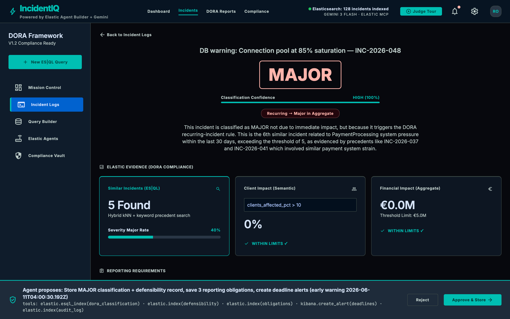

# IncidentIQ — DORA Major-Incident Triage Agent

<p>
<a href="https://incidentiq-908307939543.europe-west1.run.app"></a>


</p>

> **Google Cloud Rapid Agent Hackathon — Elastic track.** Gemini + Google Cloud Agent Builder + the Elastic MCP server, all invoked **at runtime** (no competing AI/cloud).

📐 [Architecture](ARCHITECTURE.md) · 🎨 [Design system](DESIGN_SYSTEM.md) · 🪧 [Pitch deck](DECK.md) ([PDF](DECK.pdf)) · 🖼️ [Diagram](architecture.png) · 📸 [Gallery](SCREENSHOTS.md)



When a new ICT incident hits a financial entity, IncidentIQ **reasons, plans, and acts**:
it searches similar past incidents in Elasticsearch (hybrid kNN + keyword), classifies the
incident against **DORA Art.18** thresholds informed by precedent and the recurring-incident
rule, drafts the **actual DNB early-warning submission** with Gemini 3, builds a
regulator-defensible record — and, **only after a human approves**, writes the classification,
saves the reporting obligations, and logs the audit trail. ~Seconds vs ~2 hours of manual work.

> **It's an agent, not a chatbot:** multi-step plan → real tool actions (Elastic writes) →
> human-in-the-loop approval gate → audit trail.

## 🔴 Live demo
- **App (Google Cloud Run) — open, no login:** https://incidentiq-908307939543.europe-west1.run.app
- Click **Judge Tour** in the top bar for a guided, end-to-end walkthrough.
- **30-second "wow":** on the dashboard, click the *"DB warning: connection pool at 85% saturation"* card — a zero-impact warning. IncidentIQ returns **MAJOR**, because it's the 6th PaymentProcessing incident in 30 days (the DORA recurring-incident rule most tools miss).

## Stack (Google Cloud Rapid Agent Hackathon — Elastic bucket)
- 🧠 **Gemini 3** (`gemini-3-flash-preview`) — classification rationale + drafts the DNB submission (real `@google/genai` calls, [`src/agent.js`](src/agent.js))
- 🏗️ **Google Cloud Agent Builder** — the ADK agent in [`agent-builder/incidentiq_agent/`](agent-builder/incidentiq_agent/) (Gemini 3 + Elastic MCP toolset) deploys to **Vertex AI Agent Engine**; when `AGENT_ENGINE_ID` is set the app invokes it at runtime via `reasoningEngines:streamQuery` ([`src/agent-engine.js`](src/agent-engine.js)) for the explain + DNB-draft step *(verifiable in `/health` as `agent_builder_connected`)*
- 🔍 **Elastic MCP server** (`@elastic/mcp-server-elasticsearch`) — **spawned over stdio at runtime** ([`src/elastic-mcp.js`](src/elastic-mcp.js)); hybrid kNN + keyword precedent search runs through its `search` tool *(load-bearing — verifiable in `/health` as `partner_mcp_connected`)*
- 🔢 **`gemini-embedding-001`** (768-dim) — query + corpus vectors for kNN
- ↪️ The MCP server v0.3.x is **read-only** (no ES|QL/write tool), so ES|QL aggregation and the human-approved index writes use the Elasticsearch REST API ([`src/elastic.js`](src/elastic.js)) — which also backs search as a fallback if the MCP child can't start.

## Architecture
```
Browser (public/index.html) ──POST /api/classify──► agent (src/agent.js)
  1. embed incident            → gemini-embedding-001 (768d)
  2. hybrid precedent search    → Elastic MCP server `search` tool (kNN + keyword), REST fallback
  3. classify + recurrence      → criteria.js (DORA Art.18 thresholds + aggregate rule)
  4. explain + draft submission → Gemini 3 (cites precedents; deterministic fallback)
  5. defensibility + deadlines  → version-stamped record, Art.19 timeline
  6. PROPOSE store + obligations ─┐  (consequential → GATED)
ApprovalBar (human approves) ──POST /api/execute──► Elastic writes + obligations ledger + audit log
```
The **judged** agent is [`agent-builder/agent.json`](agent-builder/agent.json) (Gemini 3 + Elastic
MCP, writes require approval). The hosted Express app invokes the **same Elastic MCP server at runtime**
for precedent search ([`src/elastic-mcp.js`](src/elastic-mcp.js)) and uses the Elastic REST API for ES|QL
aggregation + the human-approved writes (tools the read-only MCP server doesn't expose).

## Two agents
- **ElasticSearcher** — embeds the incident, runs hybrid kNN + keyword precedent search, aggregates impact via ES|QL.
- **DORAAnalyst** — applies DORA Art.18 thresholds + the recurring-incident rule + precedent signal, then Gemini 3 explains and drafts the DNB (Art.19) submission.

## DORA features
- **Art.18 classification** — 5 major-incident thresholds (clients %, transaction value, data breach, core-banking downtime, payments downtime).
- **Recurring-incident aggregation** — individually-MINOR incidents that recur on a service within 30 days escalate to MAJOR in aggregate (the rule most tools miss).
- **Art.19 reporting** — early-warning (4h) / intermediate (72h) / final (1mo) deadlines with a live countdown.
- **DNB submission draft** — the actual EBA/DORA-template notification, not a summary.
- **Defensibility record** — version-stamped rationale a regulator can challenge.
- **Shared obligation ledger** — same schema across the DORA platform; CSV-exportable.
- **Cross-app handoff** — `/api/ingest` accepts a real-time detection (e.g. from DynaCompliance) and classifies + files it.

## Endpoints
| Route | Purpose |
|---|---|
| `GET /health` | proves the stack is wired (`model`, `partner_mcp_connected`, `indexed`) |
| `GET /api/incidents` | open incidents via ES|QL |
| `POST /api/classify` | steps 1–5 (read-only): search → classify → draft |
| `POST /api/agent` | runs the full deployed Agent Builder agent (Gemini 3 + Elastic MCP) for a message |
| `POST /api/ingest` | cross-app detection handoff → classify |
| `POST /api/execute` | step 6 (gated on `approved:true`): writes + obligations + audit |
| `GET /api/obligations/:companyId` | shared ledger (`?format=csv` to export) |

## Quick start

**Zero-credential demo (canned data):**
```bash
npm install
MOCK=true npm start          # → http://localhost:8080
```

**Live (real Gemini 3 + Elastic):**
```bash
cp .env.example .env         # fill GEMINI_API_KEY + ELASTIC_URL + ELASTIC_API_KEY
npm install
npm run setup:elastic        # creates ict-incidents (768d vectors) + seeds 128 incidents (--reset to recreate)
npm start                    # → http://localhost:8080
```

### Environment (`.env`)
| Var | Notes |
|---|---|
| `GEMINI_API_KEY` | Gemini Developer API key (AI Studio). Enables `gemini-3-flash-preview` + embeddings on any host. |
| `GEMINI_MODEL` | `gemini-3-flash-preview` |
| `EMBEDDING_MODEL` | `gemini-embedding-001` (768-dim) |
| `ELASTIC_URL` / `ELASTIC_API_KEY` | Elastic Cloud endpoint + a scoped Elasticsearch API key |
| `ELASTIC_*_INDEX` | `ict-incidents` / `obligations` / `audit_log` |
| `APP_PASSWORD` (+ `APP_USERNAME`) | optional HTTP basic-auth gate (set on public deploys) |
| `MOCK=true` | run the full UI with canned data, no credentials |

## Deploy
- **Google Cloud Run (primary):** `gcloud run deploy incidentiq --source . --region=europe-west1 --allow-unauthenticated --set-env-vars="GEMINI_MODEL=gemini-3-flash-preview,..."` (Dockerfile included). Cloud Run keeps the container warm, so the Elastic MCP child process is spawned once and reused.
- The MCP server runs as a child process and needs to stay alive across requests, so a long-lived host (Cloud Run) is the supported target rather than per-request serverless.

### Deploy the Agent Builder agent (Vertex AI Agent Engine)
The [`agent-builder/incidentiq_agent/`](agent-builder/incidentiq_agent/) ADK agent (Gemini 3 + Elastic MCP toolset) is the runtime form of [`agent.json`](agent-builder/agent.json):
```bash
cd agent-builder
pip install -r requirements.txt
gcloud auth application-default login
export GOOGLE_CLOUD_PROJECT=... GOOGLE_CLOUD_LOCATION=us-central1 STAGING_BUCKET=gs://your-bucket
export ELASTIC_URL=... ELASTIC_API_KEY=...
python deploy.py            # prints AGENT_ENGINE_ID=projects/.../reasoningEngines/123
```
Set the printed `AGENT_ENGINE_ID` on the Node app. Then `/api/classify` routes its explain + DNB-draft through the deployed agent, and `POST /api/agent {"message": "..."}` runs the full agent end-to-end for judges. `/health` shows `agent_builder_connected: true`.

> **Runtime caveat:** the Elastic MCP server is a Node package (`npx`). The managed Agent Engine (Python) runtime has no Node, so by default the deployed ADK agent runs tool-free and receives the MCP-fetched precedents in its prompt (the Node app does the Elastic MCP search). To give the deployed agent its own Elastic MCP tool, deploy with `adk deploy cloud_run` (a container that includes Node) and set `ELASTIC_MCP_IN_AGENT=true`. See [`agent-builder/deploy.py`](agent-builder/deploy.py).

> **Model note:** the deployed Agent Engine agent runs **`gemini-2.5-flash`** (a Vertex-GA Gemini), because `gemini-3-flash-preview` is served by the Gemini Developer API, not as a Vertex regional publisher model. The app's direct path still uses `gemini-3-flash-preview`. Both are Gemini; the split is purely about where each model is available.

## Health check (proof for judges)
```bash
curl https://incidentiq-908307939543.europe-west1.run.app/health
# { "status":"ok", "mode":"live", "model":"gemini-3-flash-preview", "partner":"elastic",
#   "partner_mcp_connected":true,     # ← true only when the Elastic MCP child is connected + search routes through it
#   "agent_builder_connected":true,   # ← true only when the Vertex AI Agent Engine deployment is reachable
#   "elastic_rest_connected":true, "indexed":128, ... }
```

## Evals
`npm run eval` runs the golden classification set in [`evals/`](evals/).

## Learnings
- **An MCP server's stdout is sacred.** The Elastic MCP server bundles EDOT
  (`@elastic/opentelemetry-node`), whose bootstrap banner prints to **stdout** — the same
  channel the JSON-RPC protocol uses — silently corrupting every message. Setting
  `OTEL_SDK_DISABLED=true` in the child env was the difference between "connected" and a
  stream of Zod validation errors.
- **Read the partner server before trusting the docs.** The Elastic MCP server v0.3.x is
  **read-only** (`search`, `list_indices`, `get_mappings`, `get_shards`) — no ES|QL or write
  tool. We split the work honestly: search through MCP, ES|QL + gated writes through REST,
  rather than claiming tools that don't exist.
- **Design for graceful degradation.** Every external hop (Gemini, embeddings, the MCP child)
  has a fallback so a single failure degrades a feature instead of taking down the agent — and
  `/health` reports what's *actually* connected, not what we wish were.
- **DORA's hardest rule is the one tools skip:** individually-minor incidents that recur on a
  service aggregate to a *major* incident. Encoding that (ES|QL `STATS` over a 30-day window)
  was where the domain depth lived.

## License
MIT — see [LICENSE](LICENSE).
